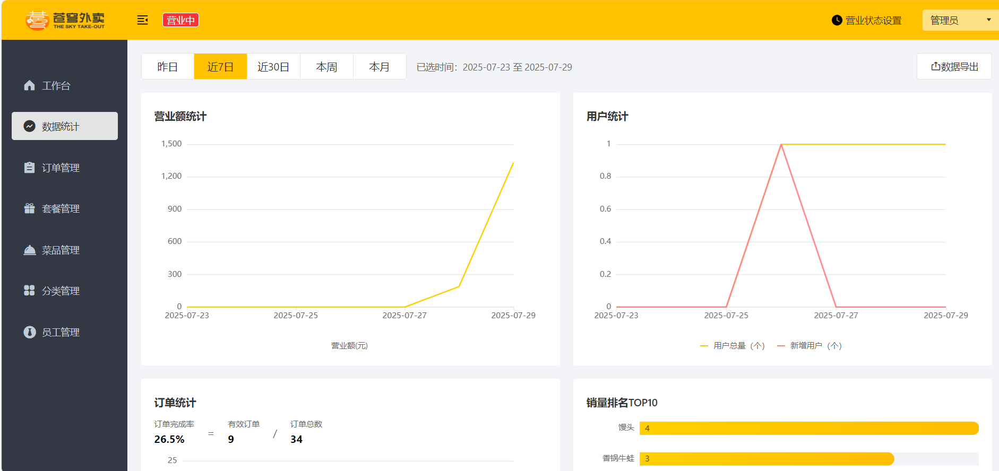
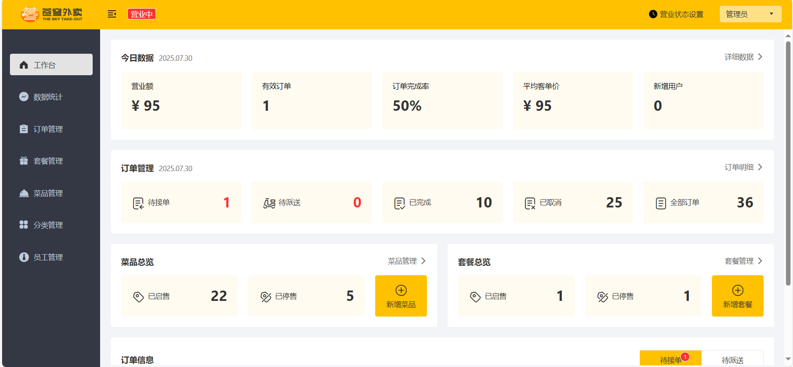
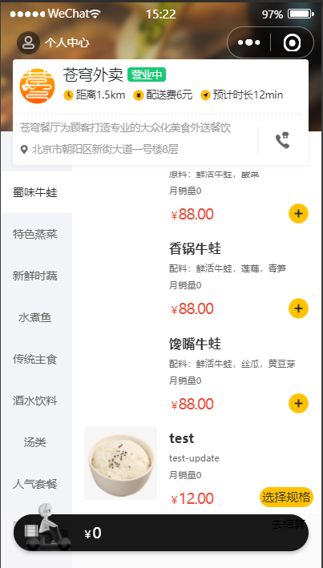
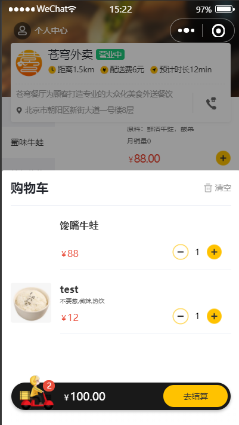
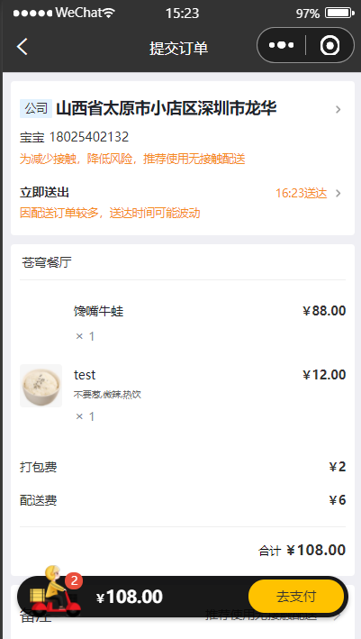
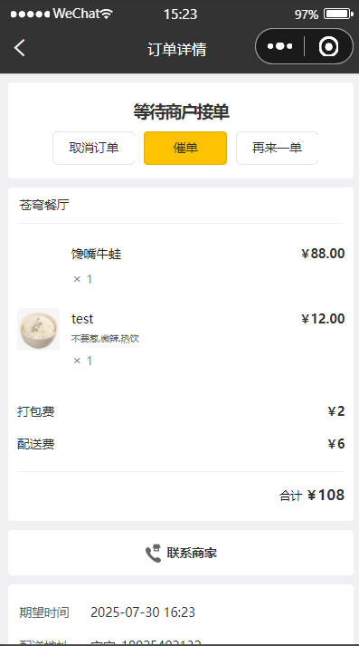

# SkyTakeOut(苍穹外卖) - 外卖平台系统

## 项目简介

苍穹外卖是一个基于Java开发的在线外卖平台系统。[教程链接](https://www.bilibili.com/video/BV1TP411v7v6/)

本仓库是我自学完成的实战项目，仅实现了后端相关功能和接口，前端界面为教程提供。该系统包括外卖平台的核心业务流程，包括用户端点餐、商家端管理等完整功能模块。


## 前置教程

- [Java基础](https://www.bilibili.com/video/BV1gb42177hm/)
- [Javaweb+AI](https://www.bilibili.com/video/BV1yGydYEE3H/)
- 我自学Javaweb+AI的[仓库链接](https://github.com/chuoer47/JavaWeb-AI-Tlias)

## 技术栈

- 后端：Java、Spring Boot、Spring MVC、MyBatis-Plus、Spring Cache、Spring Task
- 数据库：MySQL、Redis
- 其他：Swagger、WebSocket、Apache Echart、Apache POI
- 外部工具：PageHelper、AliyunOSS、微信小程序开发者工作

## 主要功能

- 用户端：浏览商品、加入购物车、提交订单、支付、查看订单状态、查看历史订单、催单、地址管理等
- 商家端：登录验证、员工/订单/菜品/套餐/分类管理、订单处理、数据统计、店铺运营设置、报表导出、数据可视化等
- 其他：小程序开发、**伪微信支付**、订单推送等


## 快速开始

1. clone该仓库
   ```bash
   git clone https://github.com/chuoer47/SkyTakeOut.git
   cd SkyTakeOut
   ```

2. 数据库配置
    - 新建MySQL数据库
    - 导入项目中`sql`目录下的初始化脚本
    - 修改后端配置文件`src/main/resources/application.yml`中的数据库连接信息：
      ```yaml
      spring:
        datasource:
          url: jdbc:mysql://localhost:<port>/<table>
          username: <username>
          password: <password>
      ```

3. Redis配置（可选，用于缓存和WebSocket）
    - 修改配置文件中的Redis连接信息：
      ```yaml
      spring:
        redis:
          host: localhost
          port: 6379
          password: 你的Redis密码（如无则留空）
      ```
4. 其他`yaml`配置
    - 添加其他配置项，如OSS、微信。

4. 项目构建与启动
    - 后端启动：直接在IDE中运行主类
    - 前端启动（百度云资料获取）

5. 访问项目
    - 后端接口地址：http://localhost:8080
    - 用户端页面：http://localhost:2077（**我修改了前端端口，以默认端口为80**）
    - 微信小程序页面：（使用对应开发者工具）

6. 测试账号（初始化数据中包含）
    - 用户端：（自己注册微信小程序开发者测试号）
    - 商家端：admin / 123456


## 资料获取

可添加黑马程序员工作号获取相关资源。也可点击[百度云资料链接](https://pan.baidu.com/s/1MNDzXyVlr3mtmLgBjcPJVw?pwd=6633#list/path=%2F)下载（可能失效）

## 踩坑记录

### 前端端口

- 运行项目时，端口被占用，修改 nginx 配置文件：../nginx-1.20.2/conf/nginx.conf
- 在WebSocket建立链接时候，如果修改端口号，会导致建立双向链接失败，解决办法详见：[【苍穹外卖】修改前端代码解决修改Nginx端口后websocket连接失败的问题](https://jishuzhan.net/article/1889199182787383297)

### 微信小程序

- 无需申请办理创作者号码，直接申请测试号即可使用，详情请去官网获取
- 微信支付跳过教程[苍穹外卖跳过微信支付](https://blog.csdn.net/XZY__one/article/details/135818055)

### AI辅助

- 重复性的CRUD操作，可以使用AI辅助完成，但需要自行检查
- 导入教程已写好代码需要注意目录结构

## 进展记录

| 视频天数阶段      | 进展内容                      | 完成时间点(视频时长)            |
|-------------|---------------------------|------------------------|
| Day01-Day02 | 开发环境+导入基本代码模块+员工模块        | 2025.07.24 (5.5H/27H)  |
| Day03-Day04 | 公共字段填充+菜品模块+套餐模块          | 2025.07.25 (9H/27H)    |
| Day05-Day06 | Redis入门学习+微信小程序开发         | 2025.07.26 (14.5H/27H) |
| Day07-Day08 | 缓存套餐+购物车需求+导入地址+下单+伪造微信支付 | 2025.07.27 (20.5H/27H) |
| Day09-10    | 实战+Task+websocket         | 2025.07.29 (22.5H/27H) |
| Day11-12    | 统计模块+工作台代码导入+Excel报表导出    | 2025.07.30 (27H/27H)   |

## 备注

本项目开发时间仓促，存在潜在bug与错误，请勿用于实际项目。

本项目仅用于学习交流，如需商业使用请联系原教程作者获取授权。

## 效果展示图


<div style="display: flex; justify-content: center;">
   
   
   
   
</div>